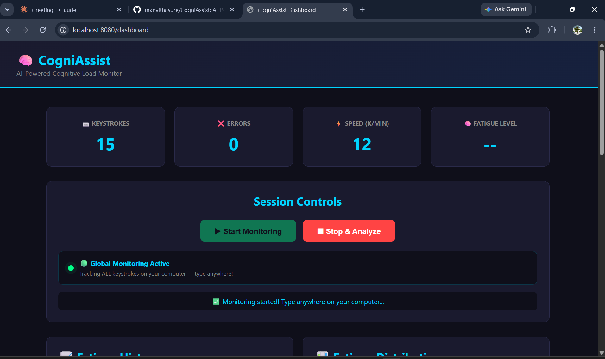

# 🧠 CogniAssist — AI-Powered Cognitive Load Monitor

> A real-time cognitive fatigue detection system that tracks
> your typing behavior globally and uses AI to assess your
> mental load — so you know exactly when to take a break.

---

## 🚀 Live Demo



---

## 💡 Problem Statement

Students and professionals often don't realize when they are
mentally exhausted while studying or working, leading to
ineffective learning and burnout. No existing tool monitors
cognitive fatigue in real-time without special hardware.

---

## ✅ Solution

CogniAssist monitors your **global keyboard activity**
in the background while you work — no interruptions.
It then uses **Groq AI (LLaMA 3)** to classify your
fatigue level and gives instant recommendations.

---

## 🎯 Features

- 🌍 **Global Keyboard Tracking** — tracks ALL keystrokes
  on your computer automatically
- 🤖 **AI Fatigue Detection** — Groq AI classifies fatigue
  as LOW / MEDIUM / HIGH
- 📊 **Real-time Dashboard** — live keystroke counter,
  speed, error rate
- 📈 **Fatigue History Chart** — visualize your cognitive
  load over time
- 🍩 **Distribution Chart** — see your fatigue patterns
- 💾 **MongoDB Storage** — all sessions saved to database
- 🔔 **Smart Alerts** — instant recommendations after analysis

---

## 🛠️ Tech Stack

| Layer | Technology |
|---|---|
| Backend | Java 17, Spring Boot 3.5 |
| AI | Groq API (LLaMA 3.3 70B) |
| Database | MongoDB |
| Frontend | HTML, CSS, JavaScript, Chart.js |
| Keyboard Hook | JNativeHook 2.2.2 |
| Build Tool | Maven |
| IDE | IntelliJ IDEA |

---

## 📦 Project Structure

CogniAssist/
├── src/main/java/com/cogniassist/
│   ├── controller/
│   │   └── SessionController.java
│   ├── model/
│   │   └── SessionData.java
│   ├── repository/
│   │   └── SessionRepository.java
│   ├── service/
│   │   ├── GeminiAIService.java
│   │   ├── KeystrokeTracker.java
│   │   └── SessionService.java
│   └── CogniAssistApplication.java
├── src/main/resources/
│   ├── templates/
│   │   └── dashboard.html
│   └── application.properties
└── pom.xml

---

## ⚙️ Setup Instructions

### Prerequisites
- Java 17+
- Maven
- MongoDB (local or Atlas)
- Groq API Key (free at console.groq.com)

### Steps

**1. Clone the repository**
```bash
git clone https://github.com/manvithasure/CogniAssist.git
cd CogniAssist
```

**2. Add your API key**

Open `src/main/resources/application.properties`:
```properties
spring.data.mongodb.uri=mongodb://localhost:27017
spring.data.mongodb.database=cogniassist
server.port=8080
groq.api.key=YOUR_GROQ_API_KEY_HERE
```

**3. Run the project**
```bash
mvn spring-boot:run
```

**4. Open dashboard**
http://localhost:8080/dashboard

---

## 🎮 How to Use
1.Open http://localhost:8080/dashboard
2.Click "▶ Start Monitoring"
3.Minimize and work normally anywhere
4.(Word, Notepad, Browser, Code editor)
5.CogniAssist tracks everything in background
6.Click "⏹ Stop & Analyze" when done
7.AI instantly shows your fatigue level!

---

## 📊 Fatigue Levels

| Level | Meaning | Recommendation |
|---|---|---|
| 🟢 LOW | Fresh and focused | Keep going! |
| 🟡 MEDIUM | Getting tired | Take a 5 min break |
| 🔴 HIGH | Very fatigued | Take a long break now! |

---

## 👨‍💻 Developer

**Manvitha** — Self-initiated individual project

- GitHub: github.com/manvithasure
- Project: CogniAssist

---

## 📄 License

This project is open source and available under the
[MIT License](LICENSE).